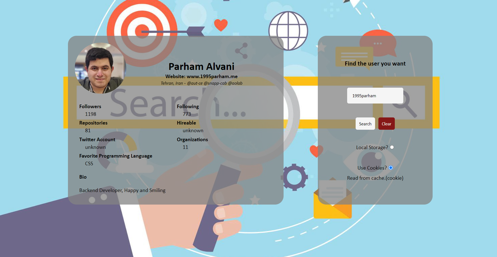

<h1 align="center">
    S7IE02
</h1>

<br />

Internet Engineering midterm project. **Github** users search engine.
In this project we are creating a simple search engine for getting information about
**Github** users by fetching API calls to **Github** and store them in a local cache.
Visit project by [link](https://ceit-aut.github.io/S7IE02).

This local cahce can be **Local Storage** or browser **Cookie**. You can set the cache type
in the application when you are submiting a search.

In this project we handle every possible error like network connection or user not found or
**Github** api failed calls.

## Execute

Double click on ```index.html``` file.

## Demo

<p align="center">
    
</p>
